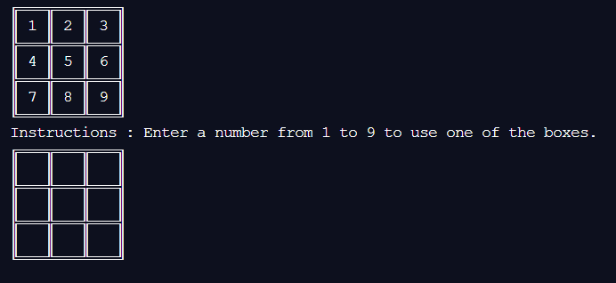

# Tic-Tac-Toe

Tic Tac Toe project

This project is creating a terminal Tic Tac Toe game using Ruby. Using 4 steps of creating on github.

## Built With

 Ruby

 GIT

 VS CODE

<h1>Getting Started</h1>

To get a local copy up and running follow these simple example steps.

## Prerequisites

- Text editor
- Github profile
- Git
- Ruby

## How to start game

- $ git clone https://github.com/coldatlas/Tic-Tac-Toe

- cd Tic-Tac-Toe folder

- run bin/main.rb from your terminal

_________________________________________

RULES FOR TIC-TAC-TOE.

The game is played on a grid that's 3 squares by 3 squares.

You are X, your friend (or the computer in this case) is O.

The first player to get 3 of her marks in a row (up, down, across, or diagonally) is the winner.

When all 9 squares are full, the game is over.

You can't choose a square that has already been chosen.

👤 **Author**

- Github: [@Mina-github ](https://github.com/coldatlas)
- Twitter: [@Mina-twitter](https://twitter.com/coldyatlas)
- Linkedin: [Mina-linkedin-link](https://www.linkedin.com/in/coldyatlas/)

## 🤝 Contributing

Contributions, issues, and feature requests are welcome!

Feel free to check the issues page.

## Show your support

Give a ⭐️ if you like this project!

## Acknowledgments

- Hat tip to anyone whose code was used
- Inspiration
- etc

## 📝 License

This project is MIT licensed.